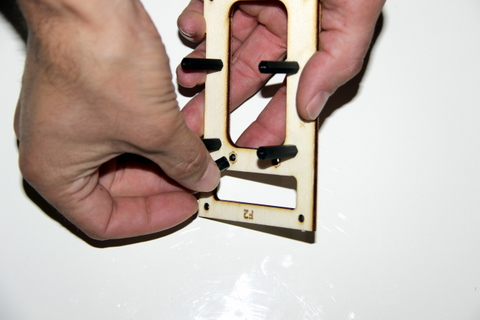

## Matériel nécessaire 
* Platine F2
* 2 vis métal à tête plate M3x5 (ø3mm, longueur 5mm)
* 2 entretoises filetées HEX NYLON 6 FEMELLES 15MM M3

## Assemblage
1. Insérez par le dessous de la platine F2 la vis métalique, puis positionnez sur la partie supérieur l'entretoise de 15mm  
  
2. Répétez l'opération pour le second trou posititionné juste à côté  
  
