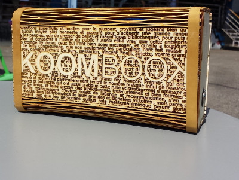

The KoomBook is a battery-operated device that displays video content, documents, images and on-line courses using a WiFi hotspot.

Thanks to an integrated web interface, anyone with a computer, tablet or smartphone can connect to and navigate through the available content.

This tool allows people in areas where there is no internet to nevertheless access digital resources. It has been deployed in Côte d’Ivoire, Cameroon, Senegal and elsewhere.

[The digital resources installed on the Koombook](https://github.com/ideascube/ansiblecube) are the product of open source projects (Wikipedia, kan academy, etc.) presented using open source software, [ideascube](https://github.com/ideascube/ideascube).

This guide presents step-by-step instructions on how to assemble a KoomBook.

There is currently two versions of the KoomBook, one in wooden case, the other one in plastic case

 