Here are the parts needed to assemble a KoomBook:

| Photo | Function | Model | Quantity | Suppliers |
| --- | --- | --- | --- | --- |
| 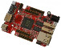 | Motherboard | A20-OlinuXIno-LIME2 | 1 | [Olimex](https://www.olimex.com/Products/OLinuXino/A20/A20-OLinuXIno-LIME2/open-source-hardware) |
| 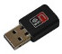 | Transceiver WiFi | Mod-Wifi-R5370 | 2 | [Olimex](https://www.olimex.com/Products/USB-Modules/MOD-WIFI-R5370/) |
|  | Operating system storage | Samsung microSDHC 16 Go | 1 | [LDLC](http://www.ldlc-pro.com/fiche/PB00163896.html) |
| 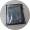 | Data storage | Crucial BX200 240 Go | 1 | [LDCL](http://www.ldlc-pro.com/fiche/PB00198020.html) |
| 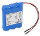 | Battery | Lithium-Ion, 7800mAh 3.7V | 1 | Farnell\/Ansmann\/[RSonline](http://fr.rs-online.com/web/p/blocs-batteries-lithium/7760872/)\/[Olimex](https://www.olimex.com/Products/Power/BATTERY-LIPO6600mAh/) |
| 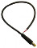 | Power cable | Pwr-Cable | 1 | [Olimex](https://www.olimex.com/Products/Components/Cables/PWR-CABLE/) |
| 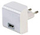 | USB plug | PRO POWER  MWUSB3U BLACK  Power Supply AC\/DC | 1 | [Farnell](http://fr.farnell.com/pro-power/mwusb3u-black/alimentation-usb-5v-2-1a-blk-euro/dp/2289559?MER=BN-2289559) |
| 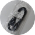 | USB cable | Usb A Male-Micro B Male, 1m | 1 | [Farnell](http://fr.farnell.com/multicomp/mc000948/cable-usb-2-0-a-micro-b-male-1m/dp/2468266) |
| 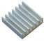 | Heat dissipater | Aluminium-Heatsink | 1 | [Olimex](https://www.olimex.com/Products/Components/Misc/ALUMINIUM-HEATSINK-20x20x6MM/) |
| 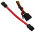 | SATA cables | SATA-CABLE-SET | 1 | [Olimex](https://www.olimex.com/Products/Components/Cables/SATA-CABLE-SET/) |
|  | Push button | Rugged metal pushbutton white LED | 1 | [SnootLab](http://snootlab.fr/lang-en/adafruit/949-rugged-metal-pushbutton-white-led-en.html) |
|  | Ethernet connector | Panel Mount Ethernet Extension Cable | 1 | [SnootLab](http://snootlab.fr/adafruit/520-cable-rj45-de-montage-en-panneau-fr.html) |
| 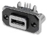 | Micro USB baseplate | Embase Micro Usb Type Ab Traversante | 1 | [Farnell](http://fr.farnell.com/amphenol-commercial-products/musb-k152-30/embase-micro-usb-type-ab-traversante/dp/2354239) |
| 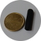 | Standoff | HEX NYLON 6 FEMALE 25MM M3 STANDOFF | 4 | [Farnell](http://fr.farnell.com/tr-fastenings/fahsngffm3-25-6/entretoise-hex-nylon-6-femelle/dp/2480026) |
| 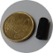 | Standoff | HEX NYLON 6 FEMALE 15MM M3 STANDOFF | 6 | [Farnell](http://fr.farnell.com/tr-fastenings/fahsngffm3-15-6/entretoise-hex-nylon-6-femelle/dp/2480024) |
| 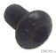 | Screws | VIS TETE BOMBEE HEXA M3X5 | 10 | [Farnell](http://fr.farnell.com/tr-fastenings/m35-bhhtmcs100/vis-tete-bombee-hexa-m3x5/dp/1420682) |
|  | Screws | VIS TETE BOMBEE HEXA M3X10 | 4 | [Farnell](http://fr.farnell.com/tr-fastenings/m35-bhhtmcs100/vis-tete-bombee-hexa-m3x5/dp/1420682) |
| 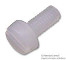 | Screws | TETE PAN PHILIPS, M3 X 10MM | 2 | [Farnell](http://fr.farnell.com/duratool/dtrnse-1207-m3-10/assort-vis-tete-pan-philips-m3/dp/2472705) |
| 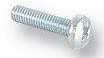 | Screws | B&F Fastener Supply PMSSS 256 0025 PH | 2 | [DigiKey](http://www.digikey.com/product-detail/en/b-f-fastener-supply/PMSSS%20256%200025%20PH/H700-ND/274911) |
|  | Wire | Fil rouge 26 AWG, 0.181 mm² | 30cm | Farnell |
| 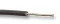 | Wire | Fil noir 26 AWG, 0.181 mm² | 10cm | Farnell |

