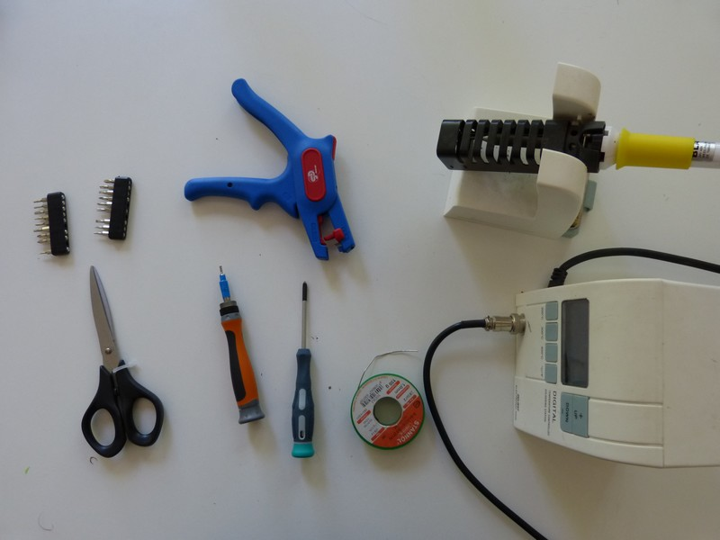

* 2mm Allen key for the M3 screws
* a cross-head screwdriver
* Fine-tipped soldering iron \(We used a [20€ SnootLab kit](http://snootlab.fr/lang-en/snootlab-shields/1033-the-everything-you-need-to-get-soldering-kit-v10-en.html)\) 
* Tin wire
* Wire cutter
* Wire stripper
* Scissors
* Flat \(slot\) screwdriver
* Adhesive self-gripping strip

