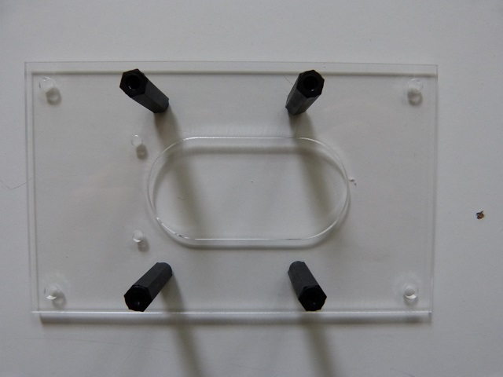

## Matériel nécessaire

* Platine F2
* 4 vis métal à tête plate M3x10 \(ø3mm, longueur 10mm\)
* 4 entretoises filetées HEX NYLON 6 FEMELLES 20MM M3

## Assemblage

1. Insérez par le dessous de la platine F2 la vis métalique, puis positionnez sur la partie supérieur l'entretoise  
   
2. Vissez l'entretoise sur la vis métalique 
   
3. Répétez pour les 3 autres entretoises  
    
	

