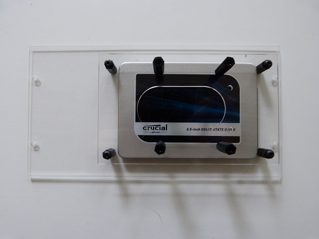

## Equipment needed
* Deck F1
* Deck F2
* 4 metal button head screws (M 3x5)

## Assembly
1. Place the deck F2 above the deck F1
   
2. Fasten the 4 corners of F2 deck with the help of the metal screws
    
  
