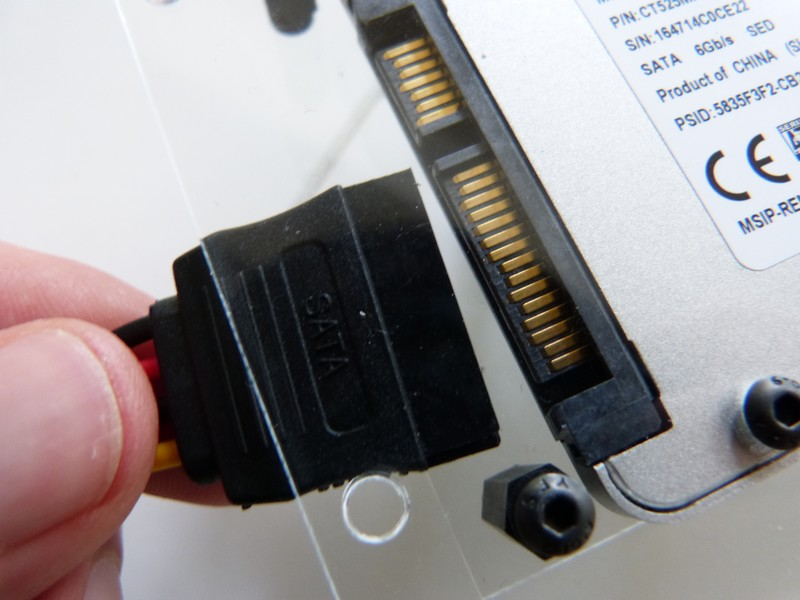
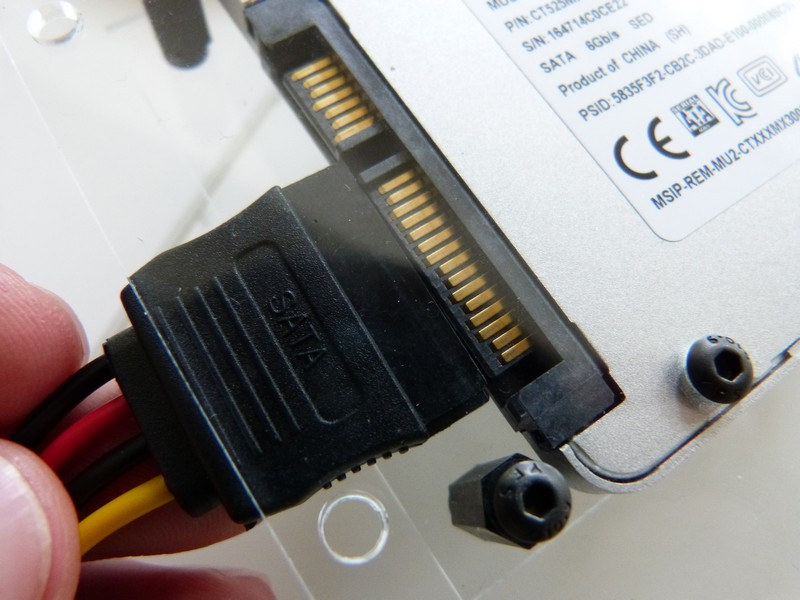
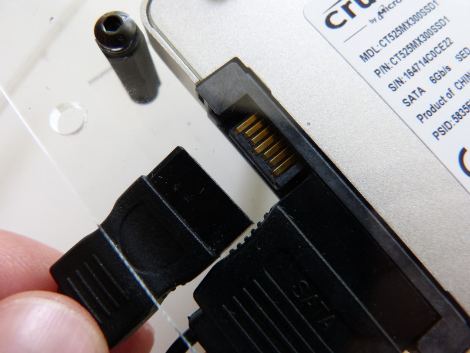
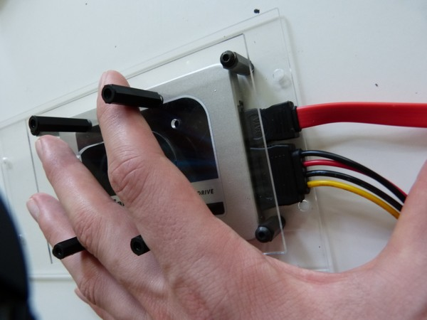
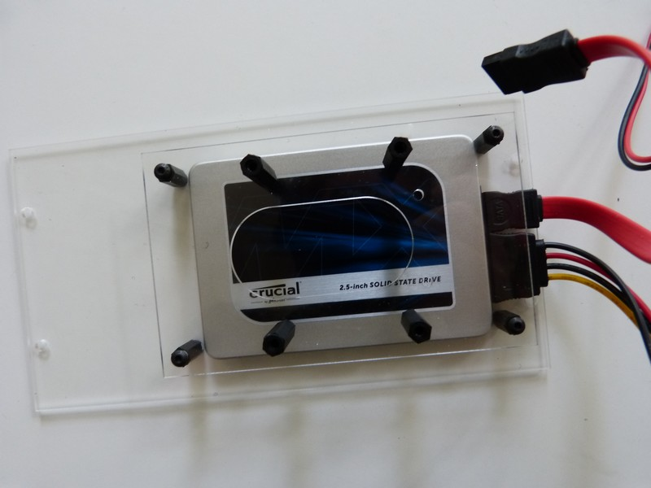

## Equipment Needed

* Red SATA cable
* Power cable \(4 wires: 2 black, 1 red and 1 yellow\)
* Assembled F1 and F2 decks

## Assembly

1. Position the wide end of the power cable against the hard disk. 
   >>>> The cable and disk can only be connected one way.  Ensure that the cable is oriented correctly and the right ends are matched up before inserting it fully.    
 
      
2. When they are correctly matched, insert completely.    
      
3. Repeat this step for the red SATA cable.    
         

Once the cables are correctly installed, it should look like this:   
      

Top view
    
