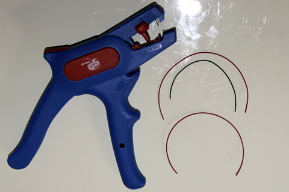
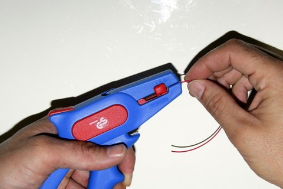
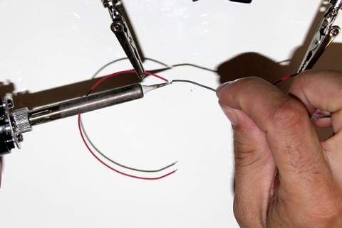
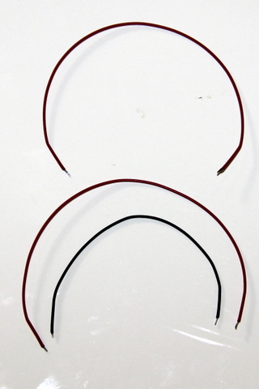

## Equipment Needed
- 10 cm of ø 0.24 mm twisted and coated copper wire (red **AND** black) 
- 15 cm of ø 0.24 mm twisted and coated copper wire (red)
- Wire stripper 
- Tin
- Soldering iron

## Assembly 

1. Strip 2 mm off both ends of each cable.    
      
2. Place a bit of tin on the tip of the soldering iron. Heat the stripped end of the wire with the iron. Place a bit of tin on the end while it is still hot so the tin completely covers the wire.    
      
>>>> Do not heat the tin for too long, as it may burn. Use as little tin as possible and complete this step in a well-aired room.

3. Repeat these steps for both ends of all 3 wires.  They should look like this:  
      