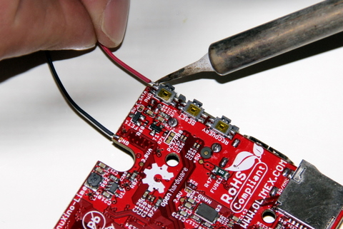

## Equipment Needed

* A20 Olimex card
* 10 cm of **tinned** red wire
* 10 cm of **tinned** black wire 
* Soldering iron

## Assembly

1. On the back of the Olimex card (the side without the heat dissipater), look for a row of three small push buttons located on the edge of the card.

2. Tin the GND chip located right underneath the switch.   
    

3. Weld the 10cm black wire onto the GND chip.    
      
10cm black wire welded onto the GND chip.    
      
4. Weld the 10cm red wire onto the **PWR switch** connector. 
   >>>> Weld the red wire onto the first \(+\) connector, not the second \(-\). Make sure the tin does not touch the existing welds.     
      
   >>>> Do not overheat the card components.
View of the back of the card with the 2 welded red and black wires.   
    

