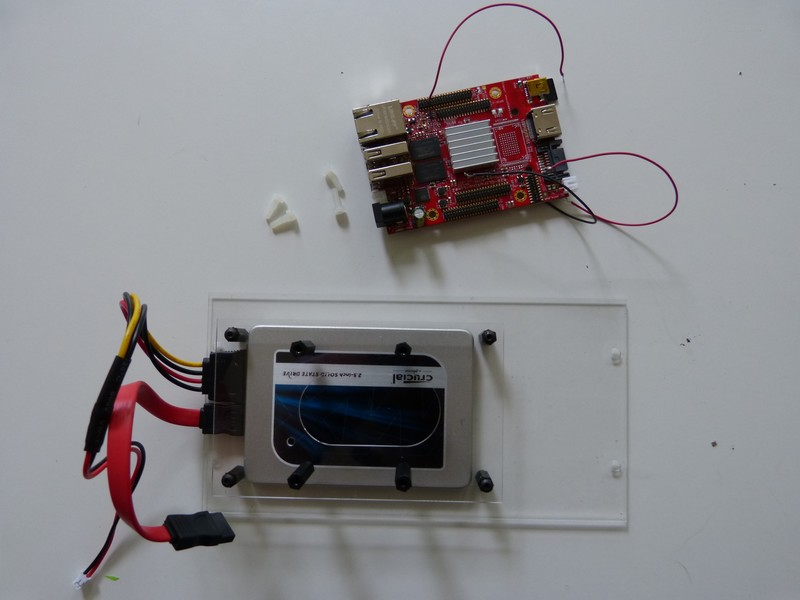
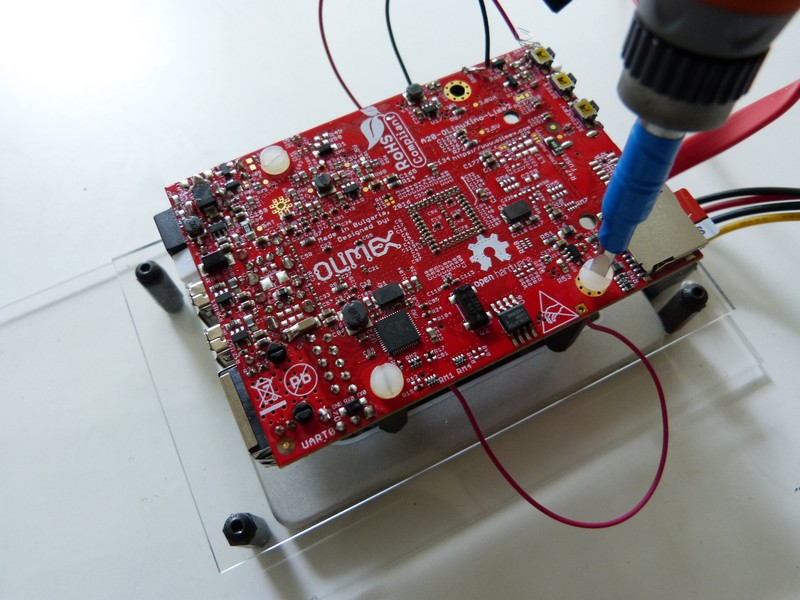
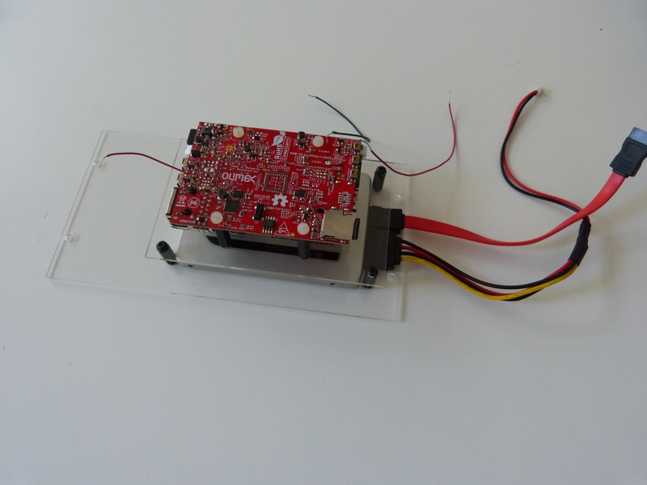

## Equipment needed
- A20 Olimex card
- F2 deck
- 2 white plastic screws (M 3x10)

  

 ## Assembly 
 
1. Place the notches of the Olimex card between the 15mm standoffs with the heat dissipater facing the disk.    
     
     
>>> Because the standoffs are six-sided, you may have trouble positioning the card on the F2 deck. Use pliers to rotate the standoffs until they are parallel to the notches on the cards.

      
2. Screw the 2 white plastic screws into the two holes located near the SD card slot to fasten the card to the F2 deck.    
      
3. Finished view of card fastened onto F2 deck.     
      
