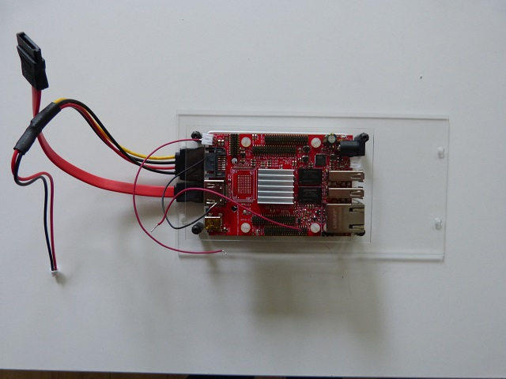

## Equipment Needed
- A20 Olimex card
- F2 deck
- 4 white plastic screws (M 3x10)

  

 ## Assembly 
 
1. Place the notches of the Olimex card between the 15-mm standoffs with the **heat dissipater facing the disk**. Then screw the 4 plastic screws to the standoffs in order to fasten the card to the deck.   
     
     

>>>> Here is an exemple of what not to do.  The side with the heat dissipater should be facing the disk.
>>>>   
