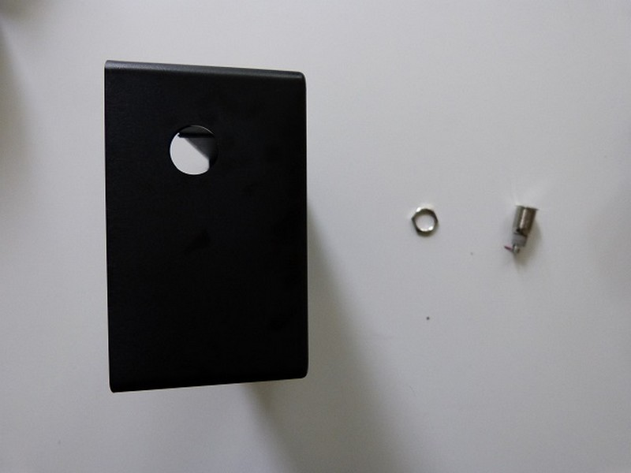
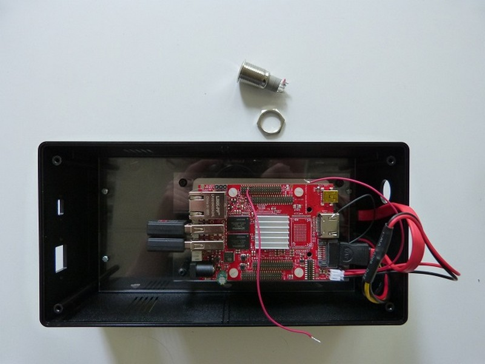
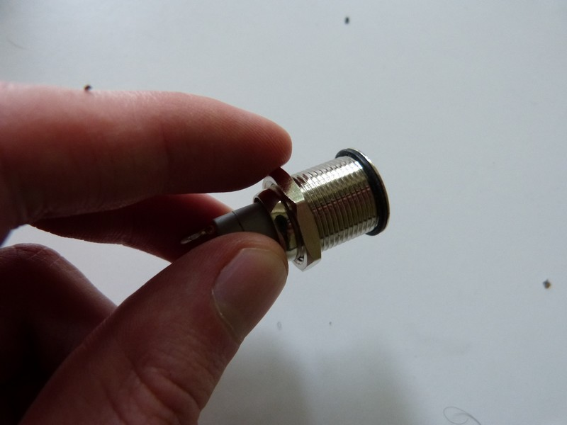
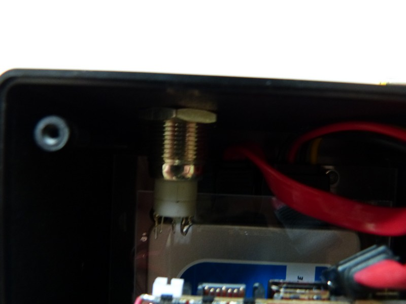
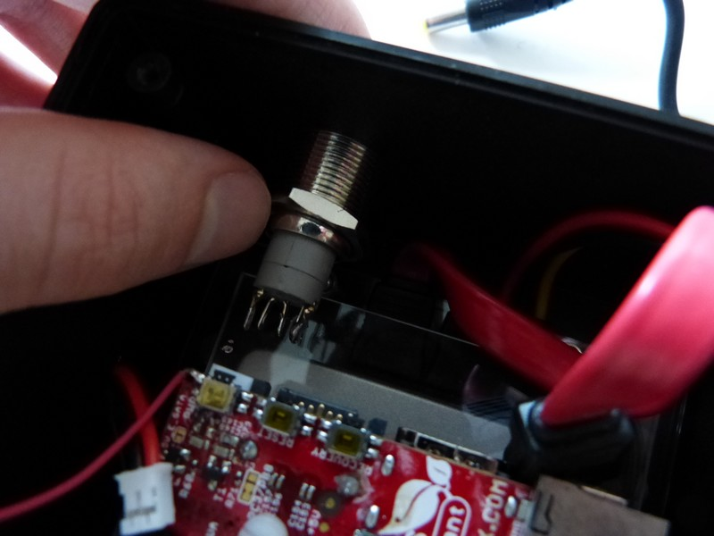
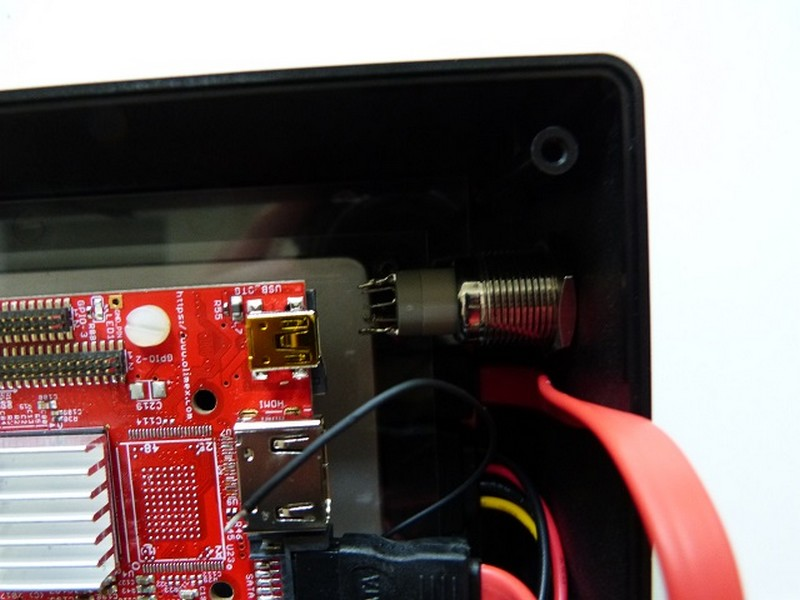

## Equipment Needed
- Pliers
- Switch
- Front of casing

 

## Assembly

1. Place the rubber seal on the switch. The seal needs to be outside, not inside, the casing.    

2. Position the switch as indicated in the photo. Correctly identify the inside and outside of the casing by locating foolproof device (two pins). Then tighten the metal washer using the pliers to correctly fasten the switch.     
 
The switch, correctly fastened.     

