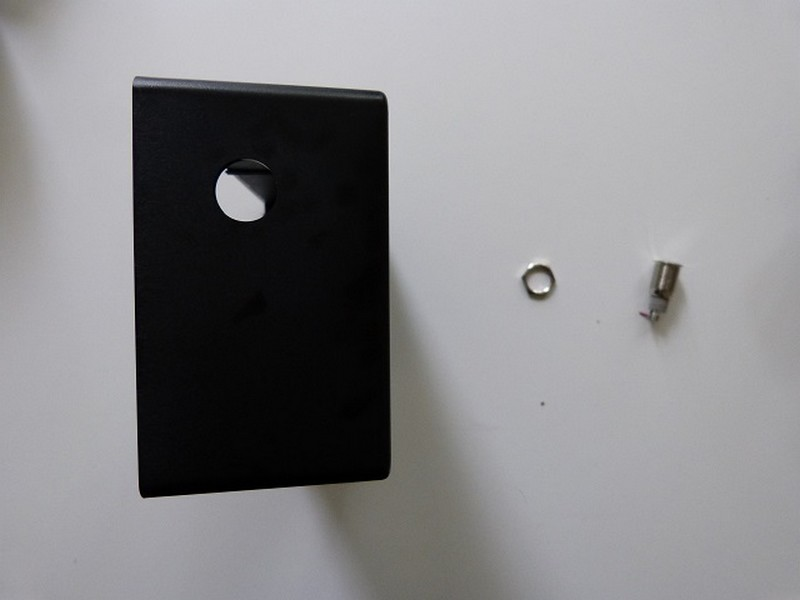
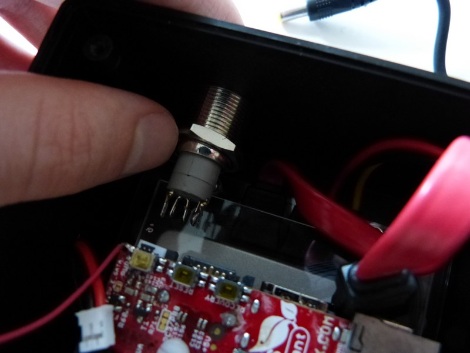
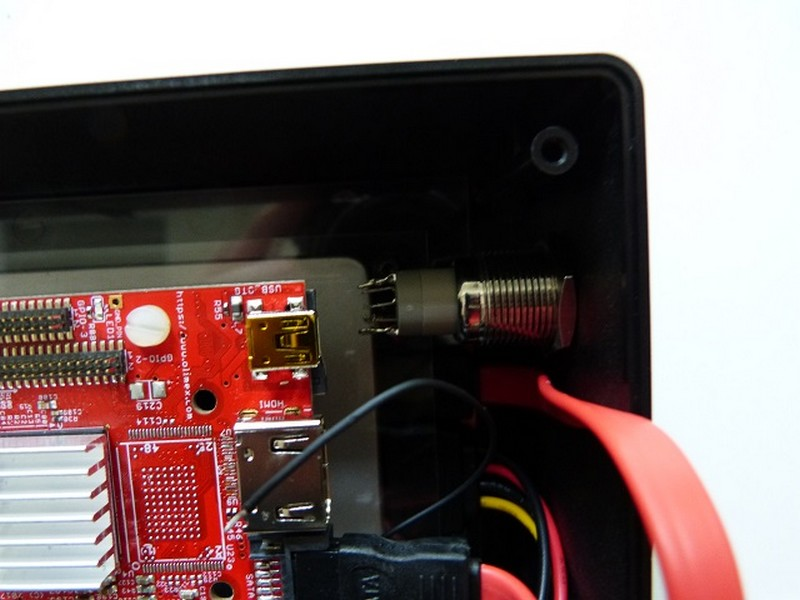

## Matériel nécessaire 
* Une pince
* Interrupteur
* Face avant du boitier 

 

## Assemblage 

1. Positionner l'interrupteur, comme présenter sur la photo. Enfin serrez la bague métalique à l'aide d'une pince pour bien fixer l'interrupteur.  
 
2. L'interrupteur en position final  

