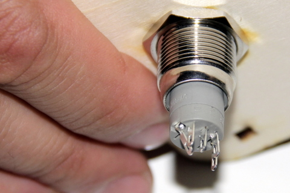
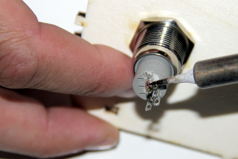
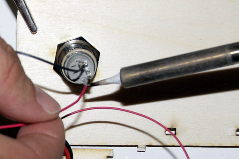
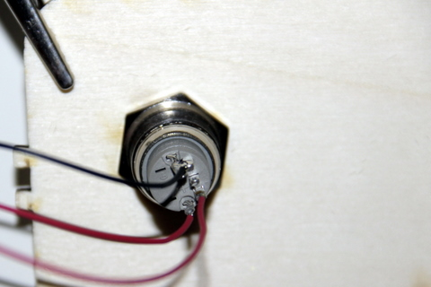

## Equipment Needed
- Soldering iron
- Switch
- Front of casing
- Olimex card, its 2 red wires and black wire

## Assembly 
1. Gently bend the (-) lug towards the C1 lug until they touch. This allows the grounds to be connected.    
      
2. Weld the (-) lug to the C1 lug.    
      
3. Weld the black wire onto the now connected (-) and C1 lugs.    
      
4. Locate the wire from the GPIO 3 (the longer, 15 cm, red wire) and weld it to the (+) lug. 
      
5. Locate the second red wire from the switch (the 10 cm red wire) and weld it to the NO1 lug (normally open)    
      

