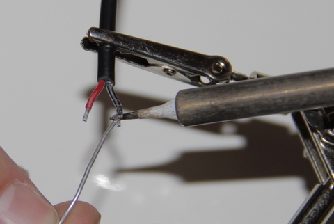
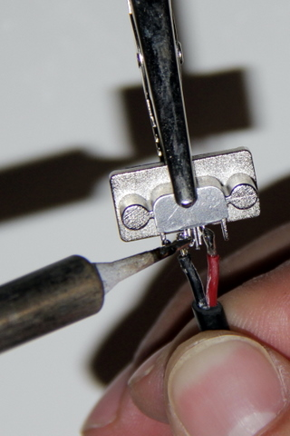
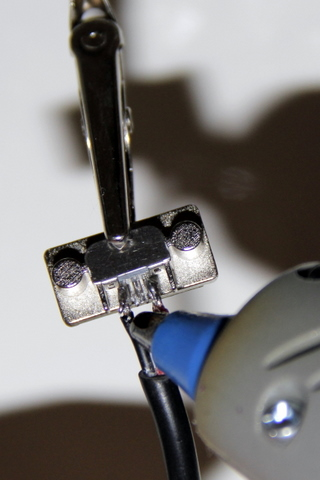
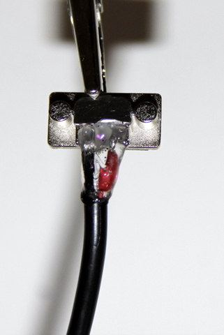

## Equipment needed
- Micro USB socket
- Black cable (with round plug)
- Glue gun

>>>> These steps must be carried out quite carefully. Handle the micro USB socket with care.

## Assembly 
1. Tin the wires.     
    
2. Weld the black cable to the micro USB socket. To do so, weld the red wire to the lug on the right side of the socket, and the black wire to the lug on the left side of the socket.     
    
3. Apply a drop of glue to the welds and around the cable to join everything together.     
    
 
It should look like this:
    