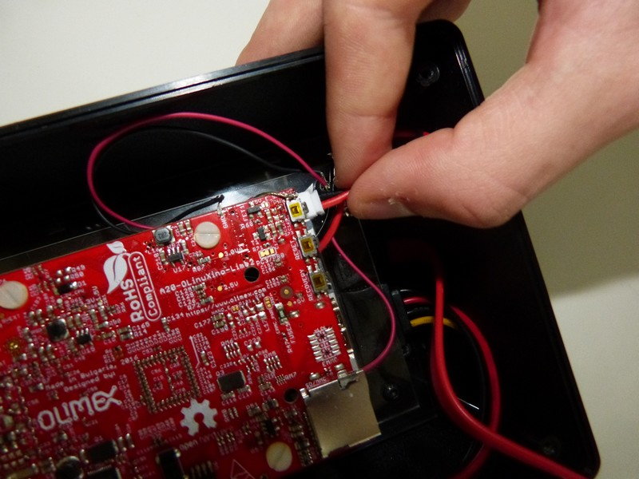
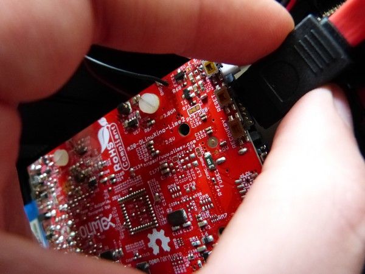
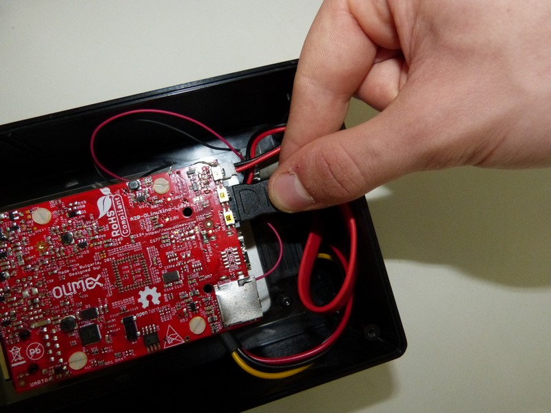

## Equipment Needed

* \(Red\) SATA cable
* Power cable
* A20 Olimex card

>>>> The cables must be connected correctly; forcing ends into the slots could damage the plugs.

## Assembly

1. Find the white connector located under the already welded switch. Connect the power cable. 
>>>> The connector is designed to allow for correct insertion only.  Trying to force the plug in the wrong way can damage it. 

      
2. Follow the same steps for the red SATA connectors. 
>>>>The connector is designed to allow for correct insertion only.  Trying to force the plug in the wrong way can damage it.   
       
      
      
   

