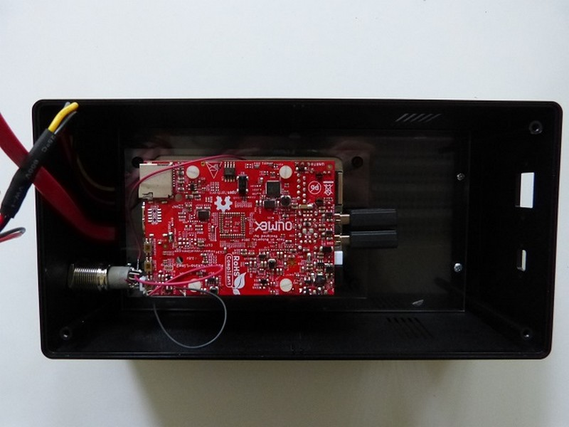
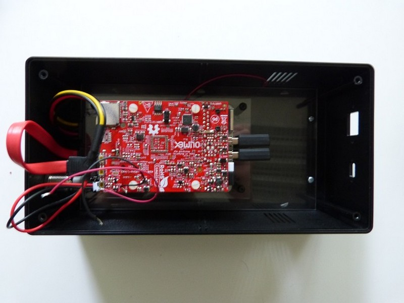

## Equipment needed

* \(Red\) SATA cable
* Power cable
* A20 Olimex card

>>>> The cables must be connected correctly; forcing ends into the slots could damage the plugs.

## Assembly

1. Find the white connector located under the already welded switch. Connect the power cable. 
>>>> The connector has a foolproof device to ensure correct insertion only.

      
2. Follow the same steps for the red SATA connectors. 
>>>>The connector has a foolproof device.    
       
      
      
   

