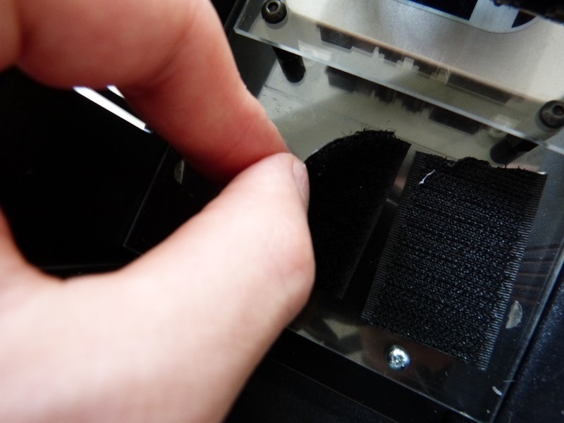

## Equipment Needed

* LiPo battery
* Adhesive self-gripping strip

## Assembly

1. Cut pieces of the adhesive self-gripping strip.
	
2. Stick one side of the self-gribbing strip to the free space left on the F`1 deck.  Put the other side of the strip on the battery.  
	
3. Put the battery on the F1 deck. Then connect the battery cable to the Olimex card.
	