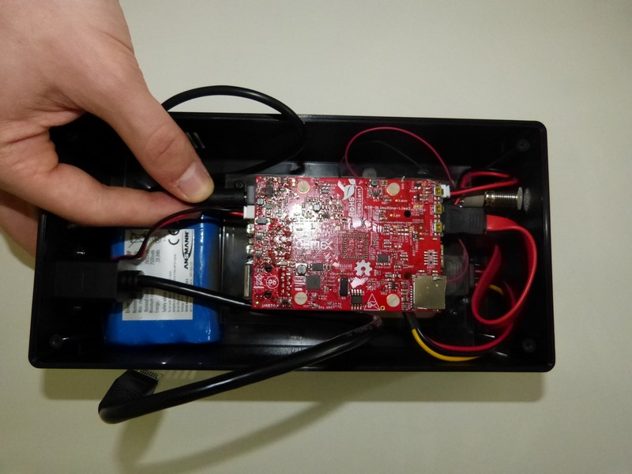
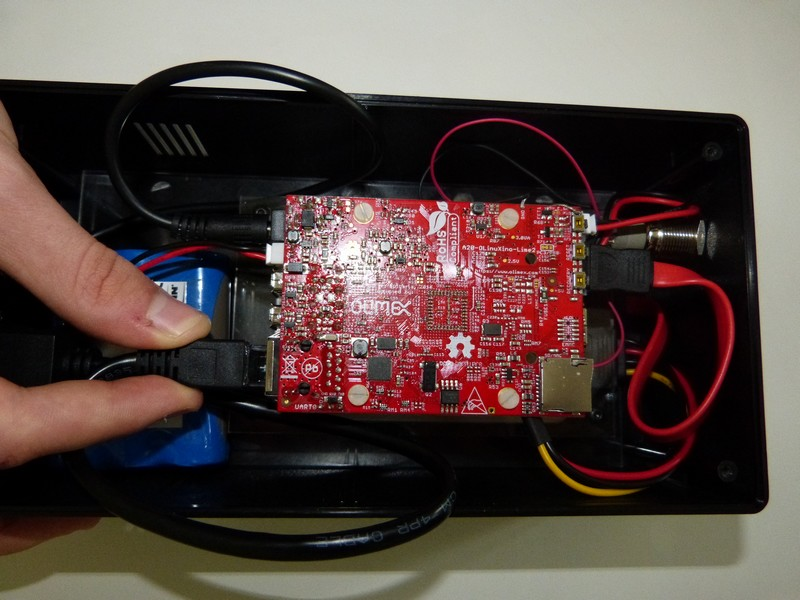
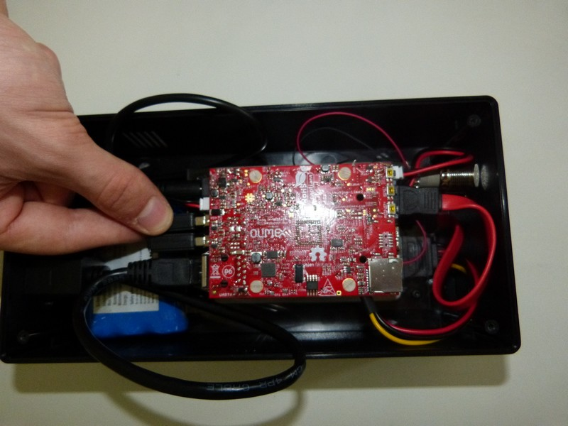

1. First, insert the round plug into the hole just to the right of the small white connector.     
    
2. Then insert the Ethernet plug.     
    
3. Then insert the 2 WiFi dongles in the 2 USB connectors.     
    
4. Insert SD card.     
5. Finished view of connected cables.     
    
