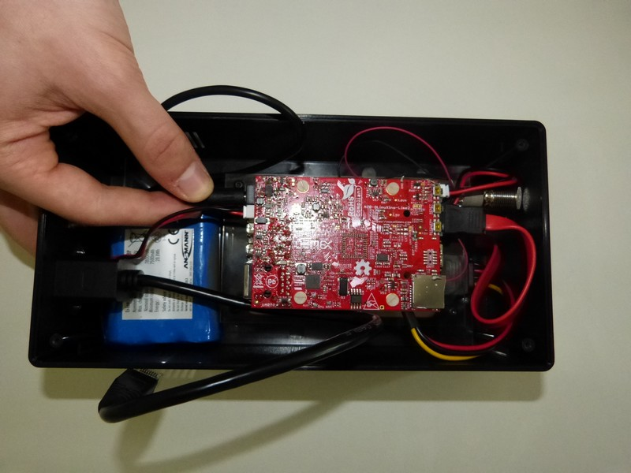
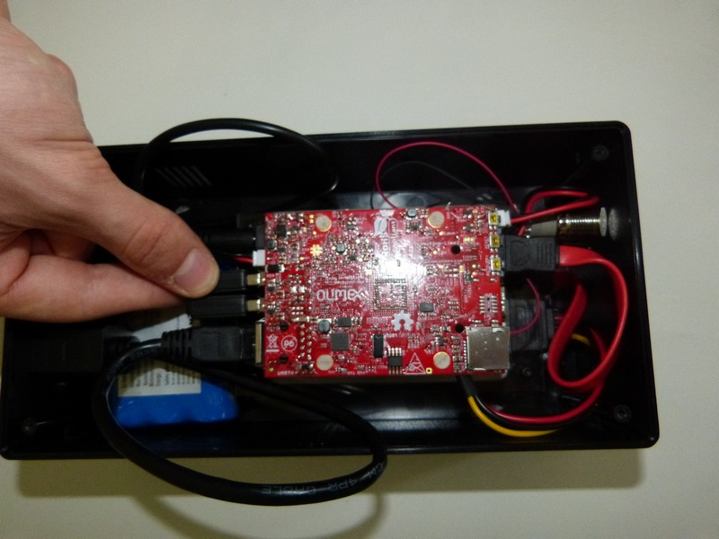

1. First, insert the round plug into the hole next to the small white connector.     
    
2. Then insert the Ethernet plug.  
    
3. Then insert the 2 WiFi dongles in the 2 USB connectors.     
    
4. Insert SD card.     

Here is the finished view of connected cables:
    
