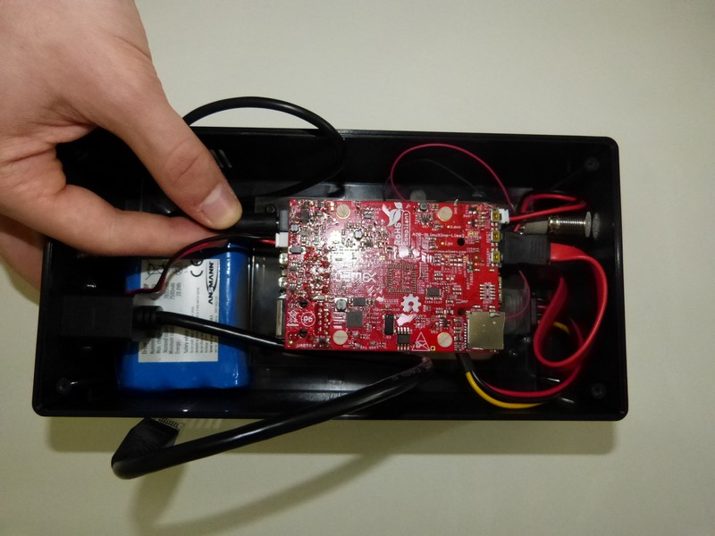
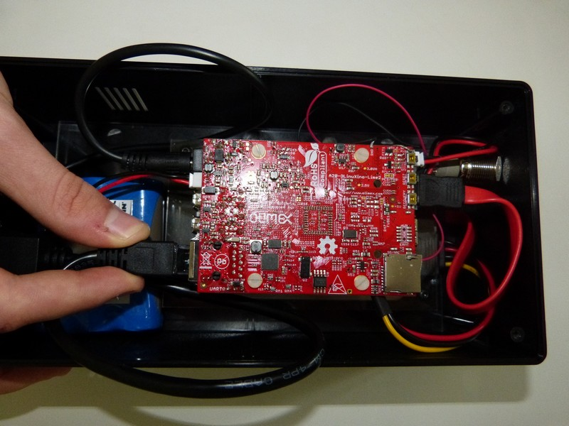
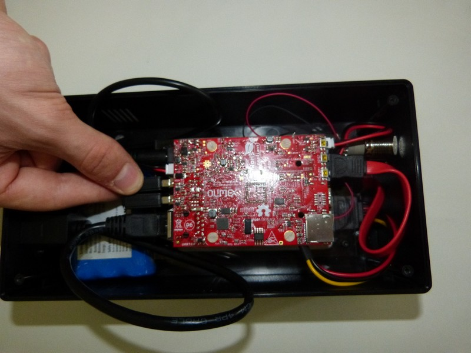
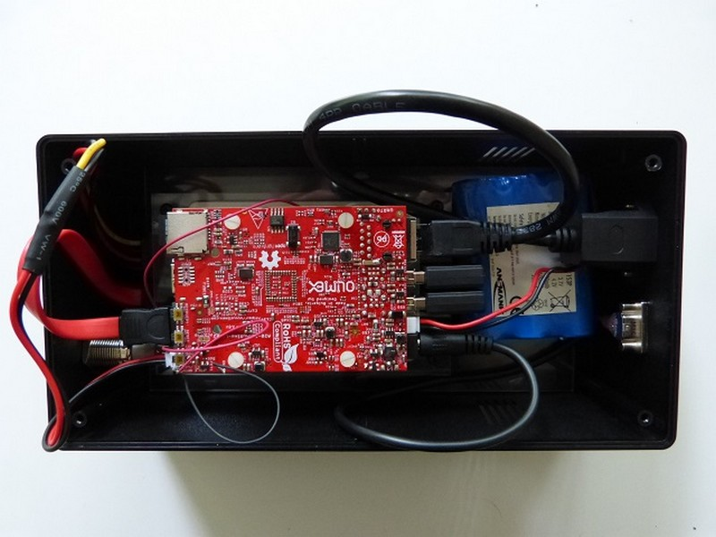

1. Commencez par la fiche ronde qui est à enfoncer juste à droite du petit connecteur blanc 

2. Poursuivez avec la fiche Ethernet   

3. Puis les 2 dongles Wifi à insérer dans les 2 connecteurs USB  

4. Insérer la carte SD

5. Vu final sur avec les câbles connectés 
