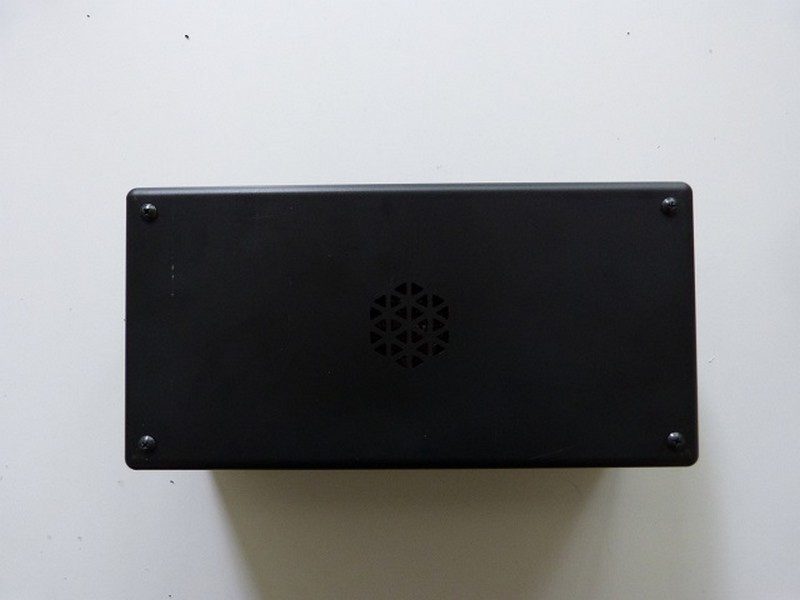

## Equipment Needed

* KoomBook case
* Case top
* 4 metal screws

## Assembly

1. Put the lid on the case, and screw it in.  Then put the yellow pads on each side of the case.  Congratulations, you have successfully set up the KoomBook!

