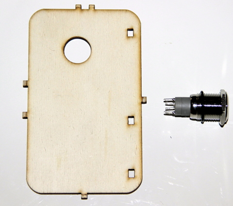
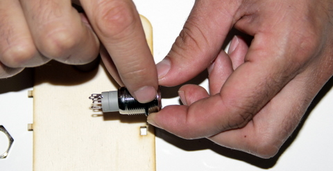
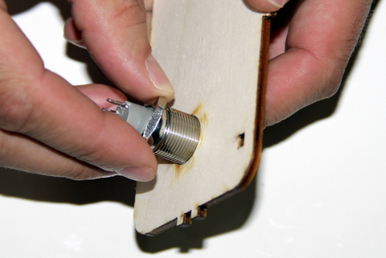
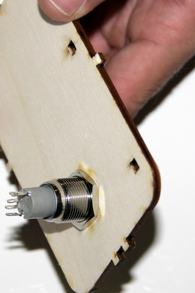

## Matériel nécessaire 
* Une pince
* Interrupteur
* Face avant du boitier  

## Assemblage 

1. Positioner le joint en caoutchou sur l'interrupteur. Le joint doit se trouver à l'extérieur du boitier et non à l'intérieur  
  
2. Positionner l'interrupteur, comme présenter sur la photo. Pour ne pas vous trompez entre la face intérieur et extérieur du boitier, repérez le détrompeur sous la forme de 2 picots. Enfin serrez la bague métalique à l'aide d'une pince pour bien fixer l'interrupteur.  
  
3. L'interrupteur en position final  
  

