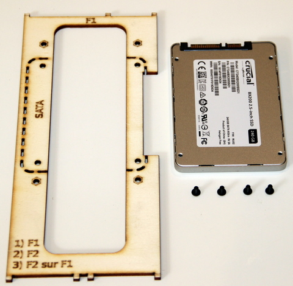
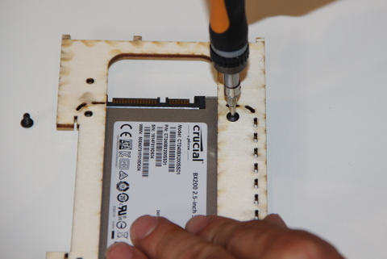
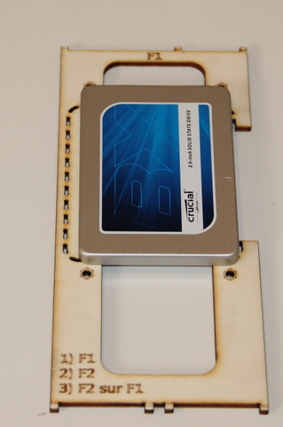

## Equipment Needed

* F1 deck (the biggest deck)
* 2.5” SATA hard drive
* 4 metal button head screws \(M 3x5\)

## Assembly

>>>>> Position the hard drive so the SATA plug is on the short side of the F1 deck

1. Place the disk on its back to have access to the threads on the back of the casing
2. Turn the F1 deck over and place it on top of the disk, as seen in the photo    
    
3. Screw together
>>>>  Do not force the screw, to avoid damaging the casing threads    
  

After completing this step, it should look like this:

Underside    
    

Top view    
    

