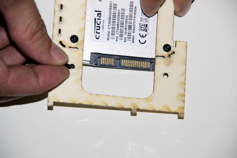
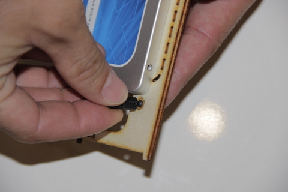
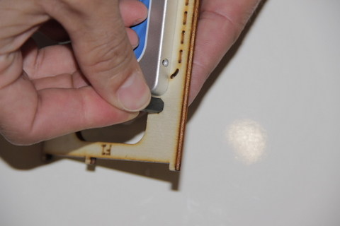
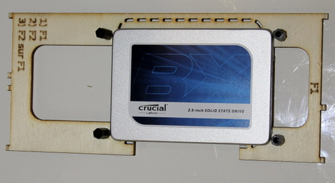

## Equipment Needed

- F1 deck
- 4 M3x5 metal flat screws (ø3 mm, 5 mm long)
- 4 threaded standoffs (HEX, NYLON 6 FEMALE, 15 mm, M3)

## Assembly

1. Insert the first metal screw through the bottom of the F1 deck. Turn the deck over while holding the screw with your index finger.    
      
2. Position the standoff on top of the screw on the other side of the F1 deck.    
      
3. Screw the standoff directly onto the screw. Do not force the screw. Doing so may damage the plastic screw thread of the standoff.   
      
4. Repeat the same steps for the 3 other standoffs.  Once completed, it should look like this:   
    

