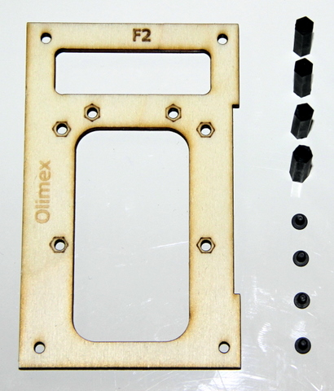
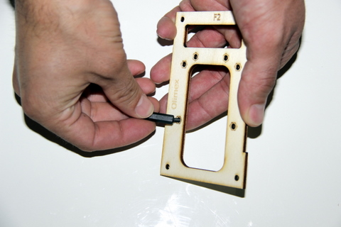
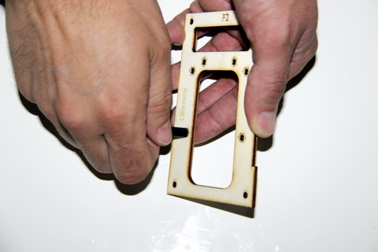
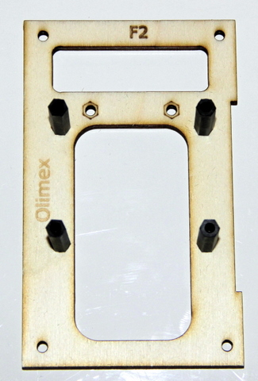

## Equipment Needed

* F2 deck
* 4 M3x10 metal flat screws \(ø3mm, 10mm long\)
* 4 threaded standoffs \(HEX, NYLON 6 FEMALE, 20mm, M3\)

## Assembly

1. Insert the metal screw from the bottom of the F2 board, then place it on the upper part the standoff.   
      
2. Screw the standoff onto the metal screw.    
      
3. Repeat the same steps for the 3 other standoffs.  Once completed, it should look like this:  
    

