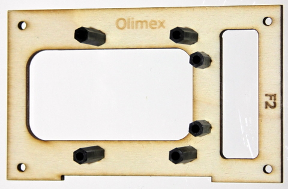

## Equipment needed

* F2 deck
* 2 M3x5 metal flat screws \(ø3 mm, 5 mm long\)
* 2 threaded standoffs \(HEX, NYLON 6 FEMALE, 15 mm, M3\)

## Assembly

1. Insert the metal screw through the bottom of the F2 deck and position it on top of the 15-mm standoff.

3. Repeat this step for the second, adjacent, hole.

