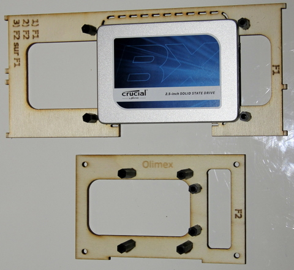
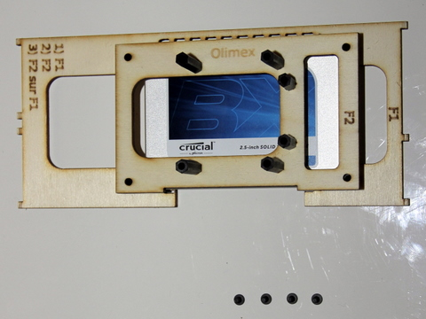
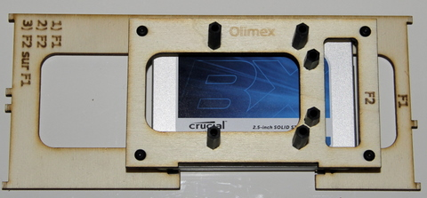

## Equipment Needed
* F1 Deck
* F2 Deck
* 4 metal button head screws (M 3x5)

## Assembly
1. Place the F2 deck on top of the F1 deck
   
2. Use the screws to attach the four corners of the F2 deck to the standoffs of the F1 deck
    

Once completed, it should look like this:
  
