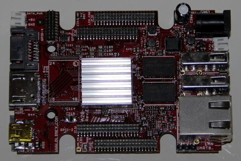

## Equipment Needed

- A20 Olimex card
- Self-adhesive heat dissipater

## Assembly

1. Remove the protective film from the adhesive strip on the heat dissipater.
      
2. Stick the adhesive side of the dissipater onto the **A20 processor**.    
      
3. Make sure it is glued to the top side of the micro processor.  It should look like this:
      

