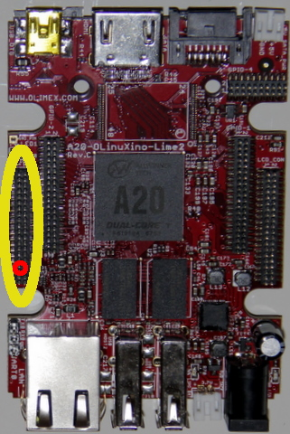

## Equipment Needed

* A20 Olimex card
* 15 cm of red wire which has been tinned at both ends
* Soldering iron
* Tin

## Assembly

1. Locate the GPIO 3 \(see the yellow circle in the photo\). 
   Then locate prong \# 33, circled in red. It is four prongs up from the bottom left-hand side of the GPIO 3.     
      
2. Tin prong \# 33 to ensure easy welding of the wire.    
      
3. Weld the red wire onto prong \# 33 of the GPIO-3 connector on the Olimex card.     
      
   >>>> Do not heat the prongs for too long during welding. Make sure the tin does not touch the adjacent prongs.

