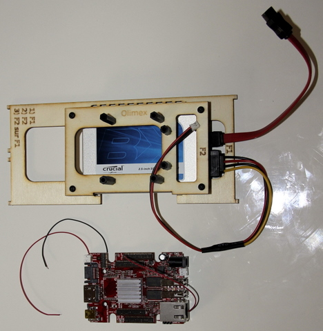
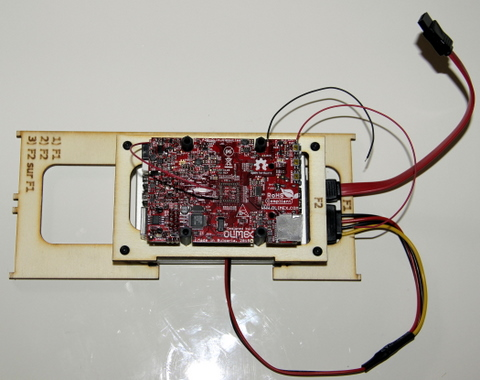
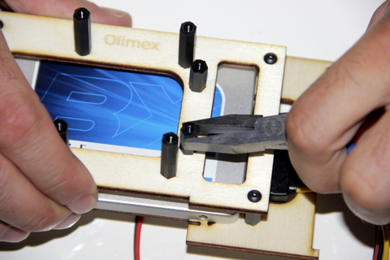
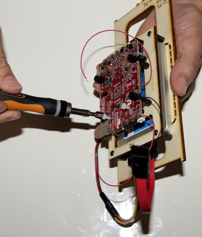
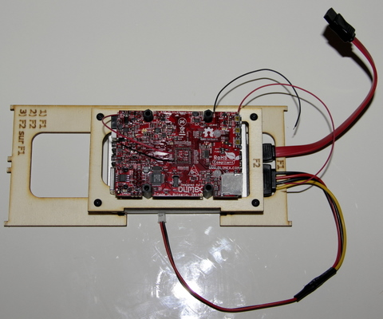

## Matériel nécessaire 
* Carte Olimex A20
* Platine F2
* 2 vis blanches plastique M3x10  

  

 ## Assemblage 
 
1. Positionner les encoches de la carte Olimex entre les entretoises de 15mm, dissipateur de chaleur face au disque  
  
>>> Les entretoises étant héxagonal, il est possible que vous rencontrés des difficultés pour positionner la carte sur la platine F2, l'astuce consiste à faire pivoter à l'aide d'une pince les entretoises jusqu'à ce qu'elles soient parrallèle aux encoches de la cartes.  

  
2. Repérez deux trous vers le slot de la carte SD et vissez les 2 vis blanches afin de fixer la carte à la platine F2  
  
3. Vu final sur la carte fixé à la platine F2  
  
