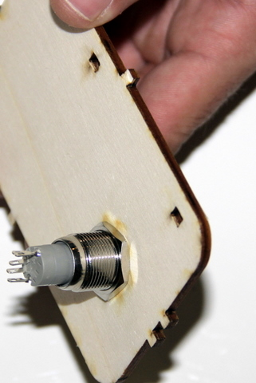

## Equipment Needed
- Pliers
- Switch
- Front of case

## Assembly

1. Place the rubber seal on the switch. The seal needs to be outside, not inside, the casing.    
      
2. Position the switch as indicated in the photo.  Use the markings on the wood to identify the inside and outside of the case. Then tighten the metal washer using the pliers to correctly fasten the switch.     
      
3. The switch, correctly insterted.     
      

