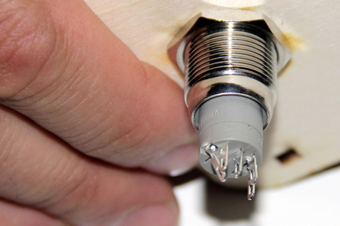

## Matériel nécessaire 
* Un fer à souder
* Interrupteur
* Face avant du boitier  
* Carte Olimex et ces 2 fils rouge et son fil noir 

## Assemblage 
1. Courber délicatement la cosse moins (-) vers la cosse notée C1 de manière à ce quelles puissent se toucher. Cela nous permet de connecter les masses entre elles
  
2. Souder la cosse moins (-) à la cosse C1 
  
3. Souder le fil noir à la cosse moins (-) et C1 maintenant connecté  
  
4. Repérez le fil provenant du GPIO 3 (le plus long normalement = 15 cm) et soudez sur la cosse plus (+)  
  
5. Repérez le second fil rouge provenant de l'interrupteur (plus court = 10 cm) et soudez le sur la cosse notée NO1 (normally open 1)  
  

