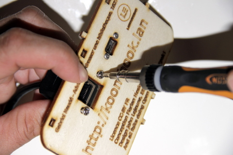

## Equipment Needed
- Micro USB socket
- Black cable (with round plug)
- Front-mounted RJ45 Ethernet socket
- Back side of casing
- 4 B&F metal screws (Fastener Supply PMSSS 256 0025 PH)

## Assembly

1. Position the micro USB socket as indicated in the photo. Use the notches and markings on the outside of the case to help you.     
    
2. Use your index finger to hold the micro USB socket in place. Insert the first metal screw through the front side (the side with writing) and tighten. Repeat this step for the second screw.     
    
3. Position the Ethernet connector as indicated in the photo.     
    
4. Attach it to the board using the two screws provided.     
    

