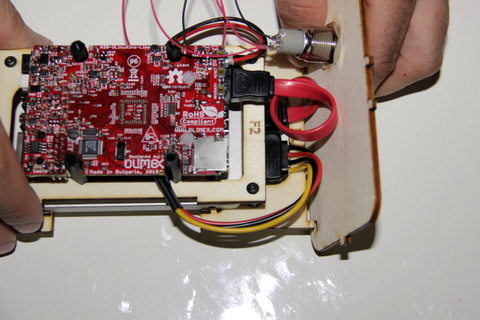

## Equipment Needed

* F1/ F2 deck
* Front plate
* Back plate

## Assembly

1. Position the front plate in the notches of the F1 deck.

2. Position the back plate in the notches of the F1 deck.

The correctly mounted front and back plate look like this:

>>>> The case is fragile at this stage. Handle it with care.

