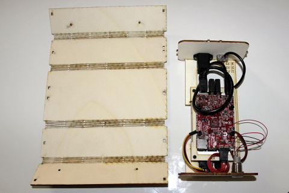
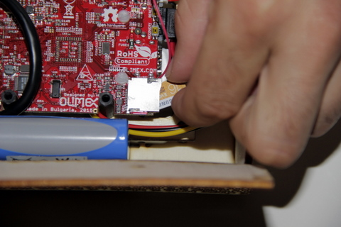

## Equipment Needed

* F1/ F2 deck
* Housing jacket
* LiPo battery

## Assembly

1. Sit the assembled F1/F2 unit on the housing jacket. 
To position the unit correctly, notice the two notches at the rear of the jacket, and one notch at the front.  Line these up with the pins on the front and back of the F1 deck.   
    
The F1/F2 deck correctly positioned on the housing jacket:     
    
2. Connect the LiPo battery to the white connector in between the USB socket and the round plug. 
>>>> This plug can only be inserted in one direction.  Trying to force it may damage the plug.

   
3. Position the battery as shown in the photo. The F1/F2 deck has a notch to fit the battery in place.     
    
4. Finish by closing the housing jacket around the F1/F2 deck. Use the notches and pins on the sides of the case to clip the housing jacket into place at regular intervals.     
    
5. Follow this step for both sides of the housing jacket.
    
6. Insert the micro-SD card.     
    
7. Close the casing.  Congratulations, you have successfully set up the KoomBook!
    

