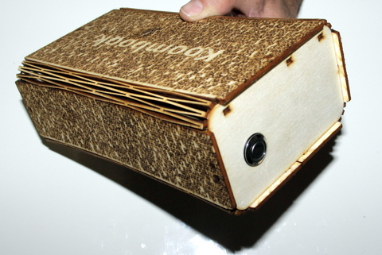

The KoomBook is a battery-operated device that displays video content, documents, images and on-line courses using a WiFi hotspot.

Thanks to an integrated web interface, anyone with a computer, tablet or smartphone can connect to and navigate through the available content.

This tool allows people to access digital resources in areas where there is otherwise no internet. It has been used in Côte d'Ivoire, Cameroon, Senegal and elsewhere.

[The digital resources installed on the Koombook](https://github.com/ideascube/ansiblecube) are the product of open-source projects (such Wikipedia, Khan Academy, etc.) presented using [ideascube](https://github.com/ideascube/ideascube), an open-source software.

This guide presents step-by-step instructions on how to assemble the KoomBook with a wooden case.  To begin, download the [wooden casing](koombook-v.2.2.svg.zip) design to be cut with a laser cutter machine

