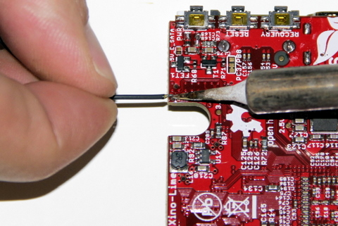
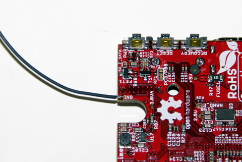
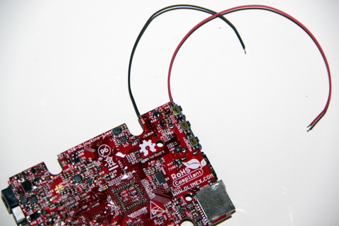

## Matériel nécessaire 
* Carte Olimex A20
* 10 cm de fil de cuivre **étamé** rouge
* 10 cm de fil de cuivre **étamé** noir
* Fer à souder

## Assemblage 
1. Repérez la face arrière de la catre Olimex. La partie arrière de la carte est la partie ou le dissipateur de chaleur n'est pas visible. Cherchez ensuite une série de 3 petits boutons poussoirs situé sur une des extrémités de la carte 

2. Etamer la pastille marqué GND juste au dessous de l'interrupteur

3. Souder le fil noir de 10 cm sur la pastille GND  
  
4. Le fil noir soudé sur la pastille GND  
  
5. Souder le fil rouge de 10 cm sur le connecteur de l'interrupteur noté **PWR**.   
>>>>Souder le fil rouge sur le premier connecteur (+) et non le sedond (-).  
Vérifier que l'étain ne chevauche pas les deux soudures existantes.

  

>>>> Ne pas faire chauffer trop longtemps les composants de la carte.

6. Vu sur le dos de la carte avec les 2 fil rouge et noir soudé  
