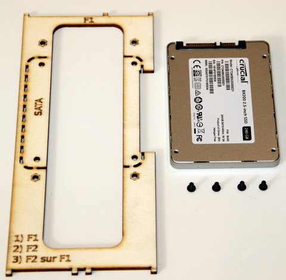
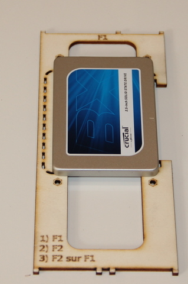

## Equipment needed

* F1 deck
* 2.5” SATA hard disk
* 4 metal button head screws \(M 3x5\)

## Assembly

>>>> Position of hard disk: SATA plug on short side of F1 deck

1. Place the disk on its back to have access to threads on the back of the casing
2. Turn the F1 deck over and place it on top of the disk, as seen in the photo    
    
3. Screw together, but do not force, to avoid damaging the casing threads    
    
4. Underside    
    
5. Top view    
    

