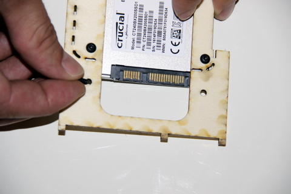
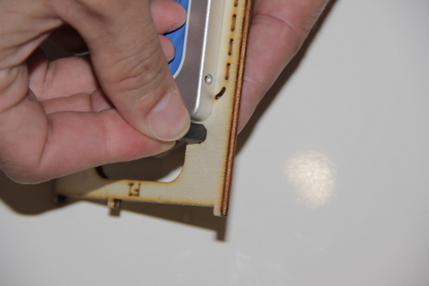

## Matériel nécessaire

* Platine F1
* 4 vis métal à tête plate M3x5 \(ø3mm, longueur 5mm\)
* 4 entretoises filetées HEX NYLON 6 FEMELLES 15MM M3  

## Assemblage

1. Insérez une première vis métal par le dessous de la platine F1, puis retournez la platine tout en maintenant la vis à l'aide de votre index
     
2. Positionnez l'entretoise sur le dessus de la platine F1 juste au dessus de la vis
     
3. Vissez l'entretoise directement sur la vis. Attention à ne pas visser trop fort au risque de déteriorer le pas de vis plastique de l'entretoise  
     
4. Répétez pour les 3 autres entretoises  
   

