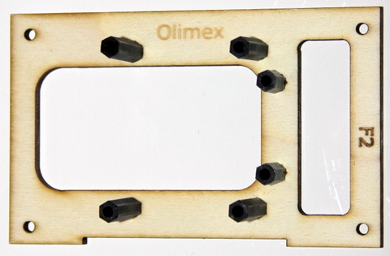
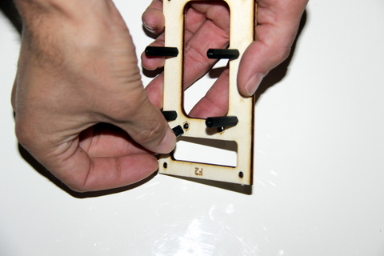

## Equipment needed

* F2 deck
* 2 M3x5 metal flat screws \(ø3mm, 5mm long\)
* 2 threaded standoffs \(HEX, NYLON 6 FEMALE, 15mm, M3\)

## Assembly

1. Insert the metal screw through the bottom of the F2 deck and position it on top of the 15mm standoff.

3. Repeat this step for the second hole, adjacent.

