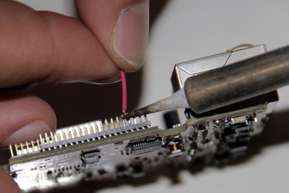

## Matériel nécessaire
* Carte Olimex A20
* 15 cm de fil de cuivre rouge **étamé** aux deux extrémités
* Fer à souder
* Etain

## Assemblage
1. Repérez le GPIO 3 désigné par un cercle jaune, puis repérez ensuite la broche N°33 cerclé en rouge. Vous pouvez également compter 4 broches à partir d'en bas à gauche du GPIO 3

2. Etamer rapidement la broche 33 afin que la sodure du fil soit facilité

3. Souder le fil rouge sur la broche n°33 du connecteur GPIO-3 de la carte Olimex

>>>>ne pas faire chauffer trop longtemps les broches lors de la soudure.
Vérifier que l'étain ne chevauche pas le broches adjacentes.

