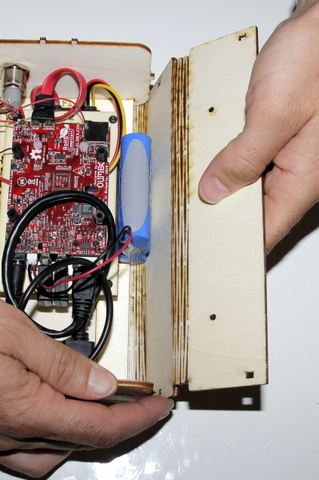

## Equipment needed

* F1/ F2 deck
* Housing jacket
* LiPo battery

## Assembly

1. Sit the assembled F1/F2 unit on the housing jacket. 
   The unit has 2 foolproof devices for the back and 1 for the front. Make sure you note where these foolproof devices are located on the housing jacket.    
    
2. The F1/F2 deck is in position on the housing jacket.     
    
3. Connect the LiPo battery to the white connector in between the USB socket and the round plug. 
>>>> This plug has a foolproof device.    
    
4. Position the battery as shown in the photo. The F1/F2 deck has a notch to fit the battery in place.     
    
5. Finish by closing the housing jacket around the F1/F2 deck. Use the notches and foolproof device on the front and back sides of the casing to clip the housing jacket into place at regular intervals.     
    
6. Follow this step on both sides.    
    
7. Insert the micro-SD card.     
    
8. Close the casing.     
    

