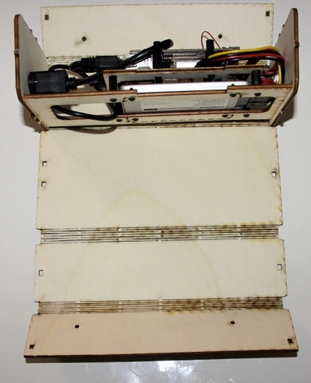
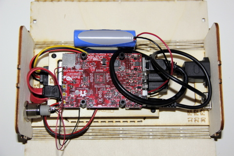
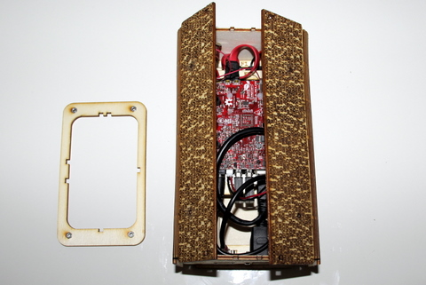
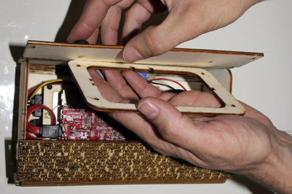
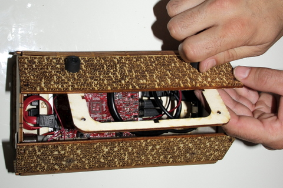

## Matériel nécessaire

* Platine F1 / F2 
* Enveloppe de boitier  
* Batterie LiPo

## Assemblage

1. Positionner l'assemblage F1 / F2 au dessus de l'enveloppe du boitier. L'assemblage possède 2 détrompeur pour la face arrière et 1 détrompeur pour la face avant. Veillez à bien respecter le positionnement de ces détrompeurs sur l'enveloppe du boitier  
     
2. La platine F1 / F2 est en position sur l'enveloppe de boitier  
     
3. Munissez vous de la batterie LiPo et connectez la au connecteur blanc situé entre la prise USB et la fiche ronde.
>>>> Cette prise possède un détrompeur ! 

     
4. La batterie se positionne comme présenté sur la photo. La platine F1 / F2 possède une encoche permettant la mise en place de la batterie  
     
5. Enfin refermez l'enveloppe autour de la platine F1 / F2. Les encoches et détrompeur sur les côtés de la façade avant et arrière du boitier permettent de fixer l'enveloppe à interval régulier  
     
6. Procédez des 2 côtés  
     
7. Enfin insérer la carte micro-SD  
     
8. Munissez vous de la dernière platine disponible  
     
9. Positionnez la en face des 2 trous d'un côté de l'enveloppe et vissez à l'aide d'un boulon  
     
     
10. Refermez le boitier et vérouillez à l'aide des deux autres boulons 
      

