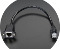
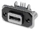
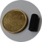
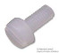
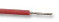
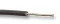

Here is the list of all the pieces necessary to assemble a KoomBook:

| Photo | Function | Model | Quantity | Suppliers |
| --- | --- | --- | --- | --- |
|  | Motherboard | Raspberry Pi 3 Model B+ | 1 | [LDLC](https://www.ldlc.com/fiche/PB00246555.html) |
|  | Operating System Storage | Samsung 16 GB microSDHC | 1 | [LDLC](http://www.ldlc-pro.com/fiche/PB00163896.html) |
|  | Data Storage | Seagate BarraCuda Pro 500 GB | 1 | [LDCL](https://www.ldlc-pro.com/fiche/PB00245153.html) |
|  | Battery | PiJuice | 1 | [LDLC](https://www.ldlc-pro.com/fiche/PB00250984.html) |
|  | USB Plug | Raspberry Pi 3 Power Supply 5.1V 2.5A Blanc | 1 | [LDLC](https://www.ldlc-pro.com/fiche/PB00205708.html) |
|  | SATA/USB Adapter | Self-Powered USB 2.0 / SATA 2.5" SSD-HDD Adapter  | 1 | [LDLC](https://www.ldlc-pro.com/fiche/PB00186500.html) |
|  | Power Button | White LED Rugged Metal Pushbutton | 1 | [SnootLab](http://snootlab.fr/lang-en/adafruit/949-rugged-metal-pushbutton-white-led-en.html) |
|  | Ethernet Connector | Panel Mount Ethernet Extension Cable | 1 | [SnootLab](http://snootlab.fr/adafruit/520-cable-rj45-de-montage-en-panneau-fr.html) |
|  | Micro USB Socket | Dual Micro USB Socket Type AB | 1 | [Farnell](http://fr.farnell.com/amphenol-commercial-products/musb-k152-30/embase-micro-usb-type-ab-traversante/dp/2354239) |
|  | Standoff | HEX NYLON 6 FEMALE 25-mm M3 STANDOFF | 4 | [Farnell](http://fr.farnell.com/tr-fastenings/fahsngffm3-25-6/entretoise-hex-nylon-6-femelle/dp/2480026) |
|  | Standoff | HEX NYLON 6 FEMELLE 15-mm M3 STANDOFF | 6 | [Farnell](http://fr.farnell.com/tr-fastenings/fahsngffm3-15-6/entretoise-hex-nylon-6-femelle/dp/2480024) |
|  | Screws | HEXA M3X5 CURVED HEAD SCREW | 10 | [Farnell](http://fr.farnell.com/tr-fastenings/m35-bhhtmcs100/vis-tete-bombee-hexa-m3x5/dp/1420682) |
|  | Screws | HEXA M3X10 CURVED HEAD SCREW | 4 | [Farnell](http://fr.farnell.com/tr-fastenings/m35-bhhtmcs100/vis-tete-bombee-hexa-m3x5/dp/1420682) |
|  | Screws | PHILIPS HEAD PAN, M3 X 10 mm | 2 | [Farnell](http://fr.farnell.com/duratool/dtrnse-1207-m3-10/assort-vis-tete-pan-philips-m3/dp/2472705) |
|  | Screws | B&F Fastener Supply PMSSS 256 0025 PH | 2 | [DigiKey](http://www.digikey.com/product-detail/en/b-f-fastener-supply/PMSSS%20256%200025%20PH/H700-ND/274911) |
|  | Wire | Red wire 26 AWG, 0.181 mm² | 30 cm | Farnell |
|  | Wire | Black wire 26 AWG, 0.181 mm² | 10 cm | Farnell |

