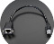
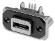
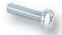
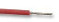
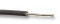

Voici la liste des pièces nécessaires pour assembler un KoomBook:

| Photo | Fonction | Désigniation | Unités | Fournisseurs |
| --- | --- | --- | --- | --- |
|  | Carte mère | Raspberry Pi 3 Model B+ | 1 | [LDLC](https://www.ldlc.com/fiche/PB00246555.html) |
|  | Stockage système d'exploitation | Samsung microSDHC 16 Go | 1 | [LDLC](http://www.ldlc-pro.com/fiche/PB00163896.html) |
|  | Stockage des données | Crucial BX200 240 Go | 1 | [LDCL](http://www.ldlc-pro.com/fiche/PB00198020.html) |
|  | Batterie | PiJuice | 1 | [LDLC](https://www.ldlc-pro.com/fiche/PB00250984.html) |
|  | Alimentation USB | Raspberry Pi 3 Power Supply 5.1V 2.5A Blanc | 1 | [LDLC](https://www.ldlc-pro.com/fiche/PB00205708.html) |
|  | Adaptateur Sata vers USB | Adaptateur USB 3.0 / SATA 2.5" SSD-HDD auto-alimenté  | 1 | [LDLC](https://www.ldlc-pro.com/fiche/PB00186502.html) |
|  | Bouton poussoir | Rugged metal pushbutton white LED | 1 | [SnootLab](http://snootlab.fr/lang-en/adafruit/949-rugged-metal-pushbutton-white-led-en.html) |
|  | Connecteur Ethernet | Panel Mount Ethernet Extension Cable | 1 | [SnootLab](http://snootlab.fr/adafruit/520-cable-rj45-de-montage-en-panneau-fr.html) |
|  | Embase Micro Usb | Embase Micro Usb Type Ab Traversante | 1 | [Farnell](http://fr.farnell.com/amphenol-commercial-products/musb-k152-30/embase-micro-usb-type-ab-traversante/dp/2354239) |
|  | Entretoise | ENTRETOISE HEX NYLON 6 FEMELLE 25MM M3 | 4 | [Farnell](http://fr.farnell.com/tr-fastenings/fahsngffm3-25-6/entretoise-hex-nylon-6-femelle/dp/2480026) |
|  | Entretoise | ENTRETOISE HEX NYLON 6 FEMELLE 15MM M3 | 6 | [Farnell](http://fr.farnell.com/tr-fastenings/fahsngffm3-15-6/entretoise-hex-nylon-6-femelle/dp/2480024) |
|  | Vis | VIS TETE BOMBEE HEXA M3X5 | 10 | [Farnell](http://fr.farnell.com/tr-fastenings/m35-bhhtmcs100/vis-tete-bombee-hexa-m3x5/dp/1420682) |
|  | Vis | VIS TETE BOMBEE HEXA M3X10 | 4 | [Farnell](http://fr.farnell.com/tr-fastenings/m35-bhhtmcs100/vis-tete-bombee-hexa-m3x5/dp/1420682) |
|  | Vis | TETE PAN PHILIPS, M3 X 10MM | 2 | [Farnell](http://fr.farnell.com/duratool/dtrnse-1207-m3-10/assort-vis-tete-pan-philips-m3/dp/2472705) |
|  | Vis | B&F Fastener Supply PMSSS 256 0025 PH | 2 | [DigiKey](http://www.digikey.com/product-detail/en/b-f-fastener-supply/PMSSS%20256%200025%20PH/H700-ND/274911) |
|  | Fil | Fil rouge 26 AWG, 0.181 mm² | 30cm | Farnell |
|  | Fil | Fil noir 26 AWG, 0.181 mm² | 10cm | Farnell |

