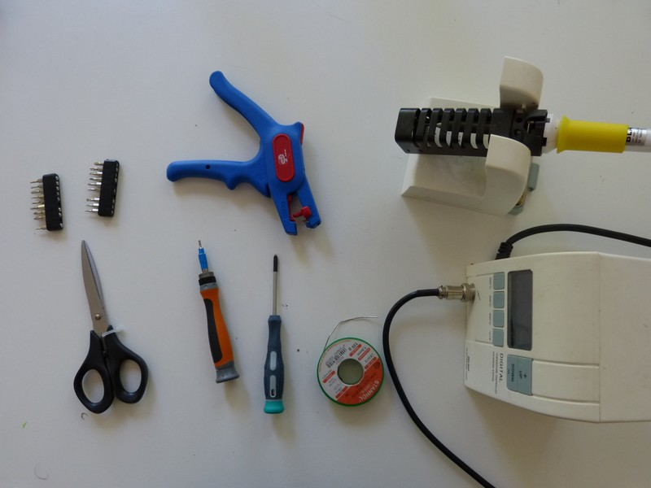

* Clé à Allen 2mm pour les vis M3
* Un tournevis cruciforme
* Un fer à souder pane fine \(Nous avons utilisé [un kit à 20€ de chez SnootLab](http://snootlab.fr/lang-en/snootlab-shields/1033-the-everything-you-need-to-get-soldering-kit-v10-en.html)\)
* Fil d'étain
* Pince à couper
* Pince à dénuder
* Ciseau
* Tournevis plat 
* Bande auto-agrippante auto-adhésive

