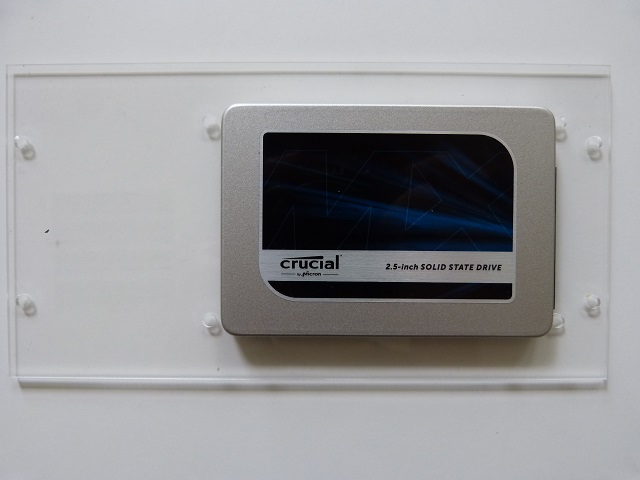

## Matériel nécessaire 
* Platine F1
* Disque SATA format 2"5
* 4 vis métal à tête bombée M3x5  

## Assemblage 
>>>> orientation du disque dur :  connectique SATA côté court de la platine F1

1. Positionez le disque sur le dos de manière à avoir accès au filetage situé au dos du boitier
2. Positionez la platine F1 comme représentez sur la photo, à l'envers au dessus du disque   

>>>> Vissez sans trop forcer, au risque d'abimer le filetage du boitier  

4. Dessous   

5. Dessus  
