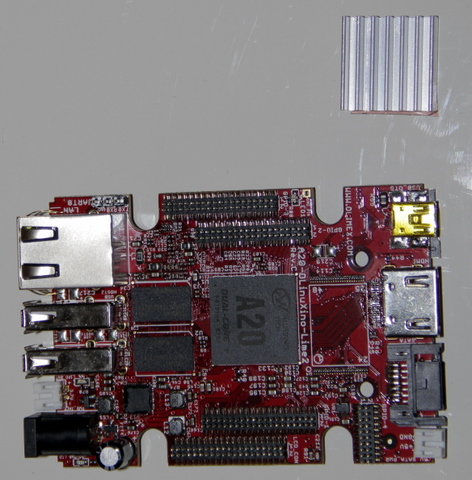
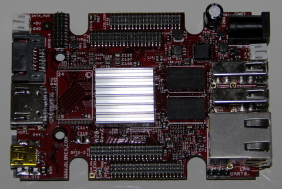

## Matériel nécessaire 
* Carte Olimex A20
* Dissipateur de chaleur auto-collant

## Assemblage 

1. Retirer la pellicule de protection de l'adhésif sur le dissipateur de chaleur.   
  
3. Poser le dissipateur côté adhésif exactement sur le processeur notée **A20**  
  
4. Veillez à ce qu'il soit positionné bien au dessus du micro processeur  
  
