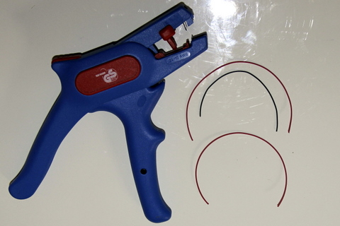
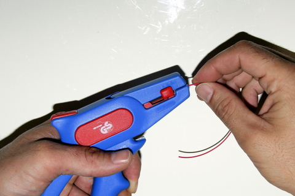
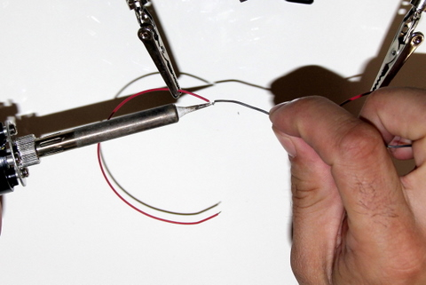
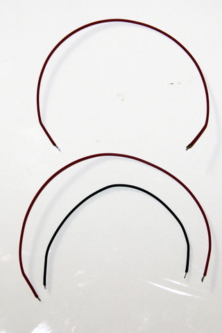

## Matériel nécessaire 
* 10 cm de fil de cuivre ø 0,24mm torsadé gaîné rouge **ET** noir
* 15 cm de fil de cuivre ø 0,24mm torsadé gaîné rouge
* Pince à dénuder
* Etain
* Fer à souder

##Assemblage 

1. Dénuder les deux extrémités de chaque câble sur 2mm  
  
2. Déposer un peu d'étain sur la panne (embout) du fer à souder. Chauffer l'extrémité dénudée du fil avec le fer à souder. Déposer un peu d'étain sur l'extrémité encore chaude pour que l'étain recouvre bien le fil  
  
>>>> Il ne faut pas faire chauffer trop longtemps l'étain au risque de le faire brûler.
Utiliser le moins d'étain possible et effectuez l'opération dans un local bien ventilé.  

3. Reproduire l'opération pour les 2 extrémitées des 3 fils  
  